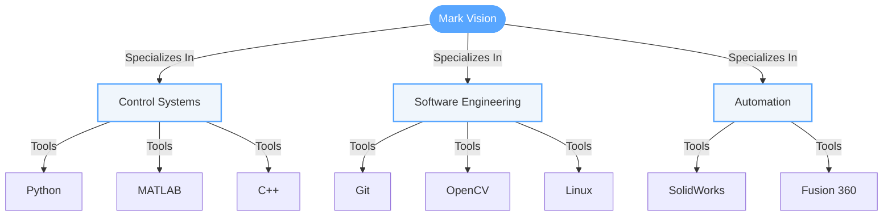
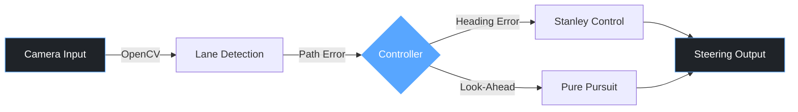
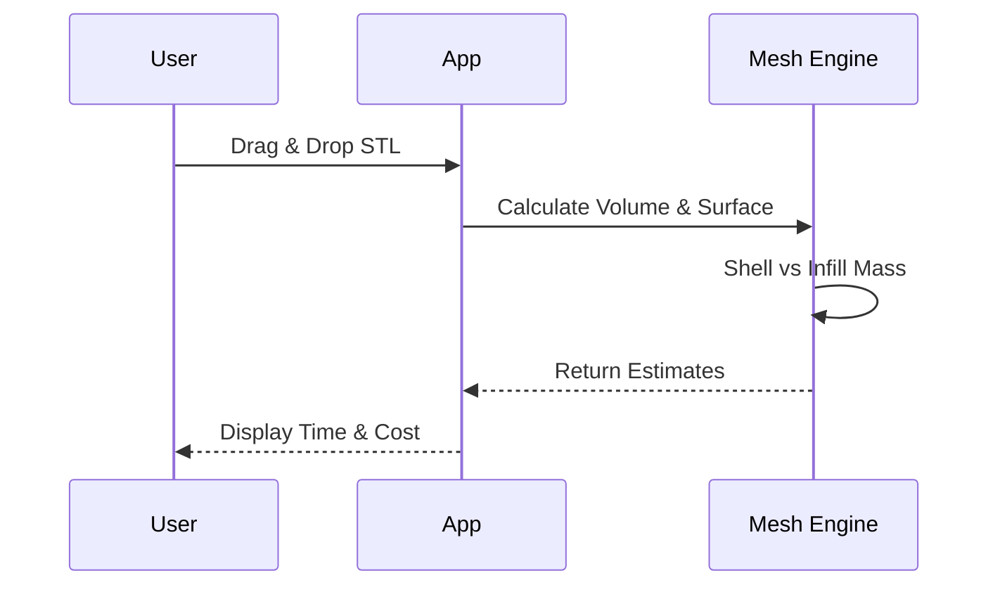

# Mark Vision

**Mechatronics Engineer** · Control Systems · Robotics

---

### 🧠 System Architecture

---

### 🛠️ Deployed Projects

#### 1. Autonomous Vehicle Simulation
*Lane-following implementation using computer vision and control theory.*

→ **[View Repository](https://github.com/Cyber717/autonomous-car-sim)**

 

#### 2. CAD Analyzer
*Desktop utility for manufacturing estimation.*

→ **[View Repository](https://github.com/Cyber717/cad-analyzer)**

---

### ⚡ Quick Status

| Attribute | Status |
| :--- | :--- |
| **Education** | Final Year Mechatronics Engineering |
| **Focus** | Bridging Hardware & Software |
| **Location** | Available for Remote/Relocation |
| **Contact** | [your.email@example.com](mailto:your.email@example.com) |

